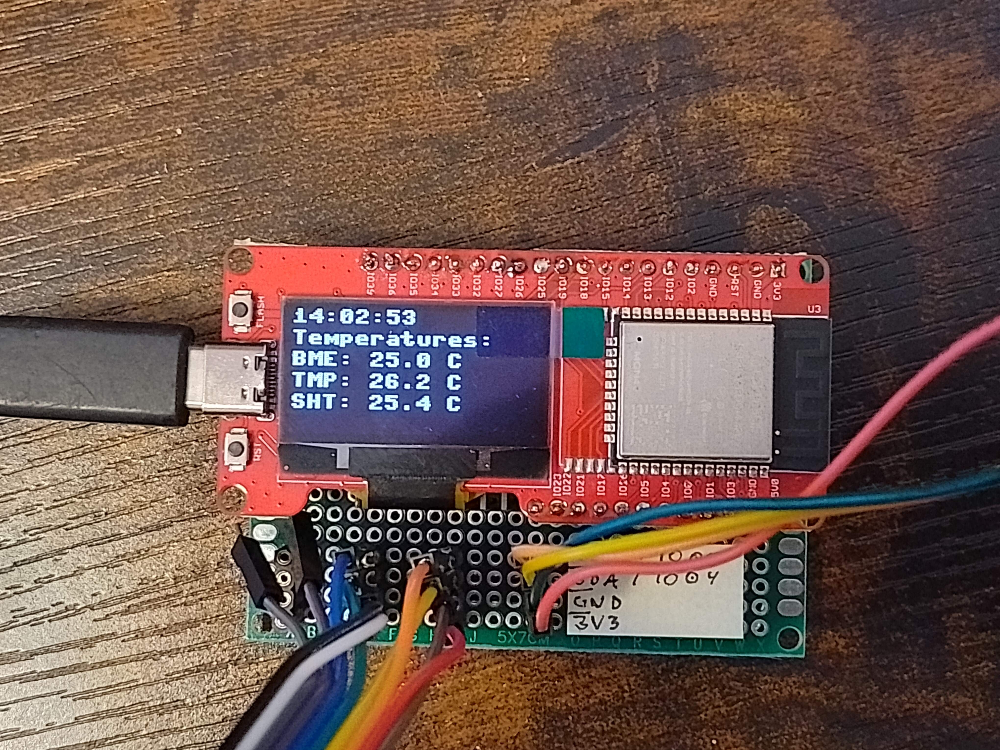
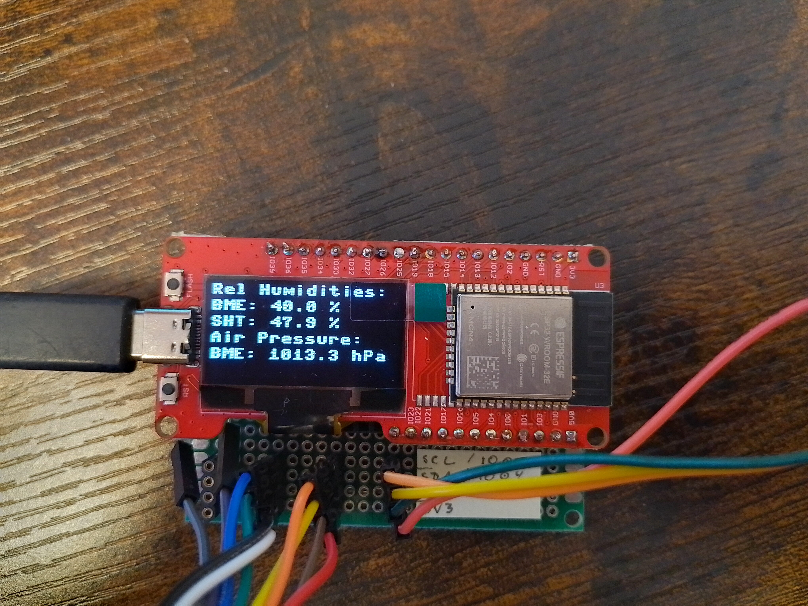

# TemperatureESP32




## Language / Sprache / Idioma:
[🇩🇪 Deutsch](#deutsch) | [🇬🇧 English](#english) | [🇪🇸 Español](#espa%C3%B1ol)

---
## Deutsch

### 📌 Projektübersicht
Dieses Projekt zeigt, wie ein **ESP32** mit verschiedenen Umweltsensoren Temperatur, Luftfeuchtigkeit und Luftdruck misst,  
die Werte auf einem **SSD1306 OLED** anzeigt und gleichzeitig in einer **CSV-Datei** auf dem ESP32 speichert.  

### 📟 Unterstützte Sensoren
- **BME280** – Temperatur, Luftfeuchtigkeit, Luftdruck  
- **BMP280** – Temperatur, Luftdruck  
- **SHT45** – Temperatur, Luftfeuchtigkeit  
- **TMP117** – hochpräziser Temperatursensor  
- **SSD1306 OLED** – Anzeige (I2C, 128x64)  

### ✨ Funktionen
- Automatische Sensorerkennung über I2C
- WLAN-Verbindung herstellen (SSID & Passwort im Code)
- Zeitsynchronisation per NTP
- CSV-Datenlogging im internen Speicher (`log.csv`)
- Abwechselnde Anzeige von Temperatur- und Feuchtigkeitswerten auf dem OLED

### 🔌 Verdrahtung (Standard im Code)
| Komponente  | Pin ESP32 | Hinweis |
|-------------|-----------|---------|
| SDA (I2C)   | GPIO4     | Anpassbar im Code |
| SCL (I2C)   | GPIO5     | Anpassbar im Code |
| VCC         | 3.3V      | Alle Sensoren |
| GND         | GND       | Alle Sensoren |

**I2C-Standardadressen:**
- BME280 / BMP280 → `0x76` oder `0x77`
- SSD1306 OLED → `0x3C`
- SHT45 → `0x44`
- TMP117 → `0x48`

### 🚀 Installation & Verwendung
1. **MicroPython auf ESP32 flashen**  
   → z. B. mit [Thonny](https://thonny.org) oder `esptool.py`
2. **Bibliotheken hochladen** (`ssd1306.py`, `bmp280.py`, `bme280.py`, `sht4x.py`, `tmp117.py`)
3. Hauptskript `main.py` auf den ESP32 kopieren
4. WLAN-Zugangsdaten im Code anpassen:
   ```python
   connect_wifi("MEIN_WIFI", "MEIN_PASSWORT")
   ```
5. ESP32 starten – die Messwerte erscheinen auf dem OLED und werden in `log.csv` gespeichert.

---

## English

### 📌 Project Overview
This project demonstrates how an **ESP32** can measure temperature, humidity, and air pressure using various environmental sensors,  
display the data on an **SSD1306 OLED** screen, and store it in a **CSV file** on the ESP32.  

### 📟 Supported Sensors
- **BME280** – temperature, humidity, pressure  
- **BMP280** – temperature, pressure  
- **SHT45** – temperature, humidity  
- **TMP117** – high-precision temperature sensor  
- **SSD1306 OLED** – display (I2C, 128x64)  

### ✨ Features
- Automatic I2C sensor detection
- Wi-Fi connection (SSID & password in code)
- Time synchronization via NTP
- CSV data logging (`log.csv`) in internal storage
- Alternating display of temperature and humidity values

### 🔌 Wiring (default in code)
| Component   | ESP32 Pin | Note |
|-------------|-----------|------|
| SDA (I2C)   | GPIO4     | Can be changed in code |
| SCL (I2C)   | GPIO5     | Can be changed in code |
| VCC         | 3.3V      | All sensors |
| GND         | GND       | All sensors |

**Default I2C Addresses:**
- BME280 / BMP280 → `0x76` or `0x77`
- SSD1306 OLED → `0x3C`
- SHT45 → `0x44`
- TMP117 → `0x48`

### 🚀 Installation & Usage
1. **Flash MicroPython** to the ESP32  
   → e.g., with [Thonny](https://thonny.org) or `esptool.py`
2. **Upload libraries** (`ssd1306.py`, `bmp280.py`, `bme280.py`, `sht4x.py`, `tmp117.py`)
3. Copy main script `main.py` to the ESP32
4. Edit Wi-Fi credentials in code:
   ```python
   connect_wifi("MY_WIFI", "MY_PASSWORD")
   ```
5. Restart ESP32 – readings will be shown on OLED and saved to `log.csv`.

---

## Español

### 📌 Descripción del Proyecto
Este proyecto muestra cómo un **ESP32** puede medir temperatura, humedad y presión atmosférica usando varios sensores ambientales,  
mostrar los datos en una pantalla **SSD1306 OLED** y guardarlos en un **archivo CSV** en el ESP32.  

### 📟 Sensores Compatibles
- **BME280** – temperatura, humedad, presión  
- **BMP280** – temperatura, presión  
- **SHT45** – temperatura, humedad  
- **TMP117** – sensor de temperatura de alta precisión  
- **SSD1306 OLED** – pantalla (I2C, 128x64)  

### ✨ Funciones
- Detección automática de sensores por I2C
- Conexión Wi-Fi (SSID y contraseña en el código)
- Sincronización de hora por NTP
- Registro de datos en CSV (`log.csv`) en memoria interna
- Pantalla alterna entre valores de temperatura y humedad

### 🔌 Conexiones (por defecto en el código)
| Componente  | Pin ESP32 | Nota |
|-------------|-----------|------|
| SDA (I2C)   | GPIO4     | Se puede cambiar en el código |
| SCL (I2C)   | GPIO5     | Se puede cambiar en el código |
| VCC         | 3.3V      | Todos los sensores |
| GND         | GND       | Todos los sensores |

**Direcciones I2C por defecto:**
- BME280 / BMP280 → `0x76` o `0x77`
- SSD1306 OLED → `0x3C`
- SHT45 → `0x44`
- TMP117 → `0x48`

### 🚀 Instalación y Uso
1. **Flashear MicroPython** en el ESP32  
   → p. ej. con [Thonny](https://thonny.org) o `esptool.py`
2. **Subir librerías** (`ssd1306.py`, `bmp280.py`, `bme280.py`, `sht4x.py`, `tmp117.py`)
3. Copiar el script principal `main.py` al ESP32
4. Editar credenciales de Wi-Fi en el código:
   ```python
   connect_wifi("MI_WIFI", "MI_CONTRASEÑA")
   ```
5. Reiniciar el ESP32 – las lecturas aparecerán en la pantalla OLED y se guardarán en `log.csv`.
